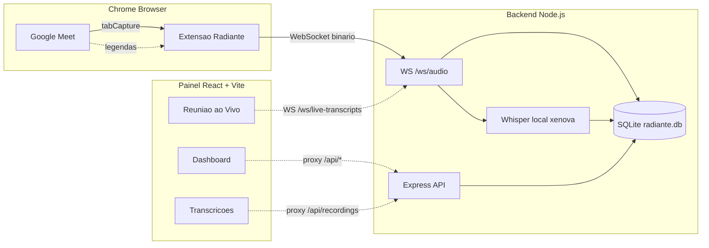
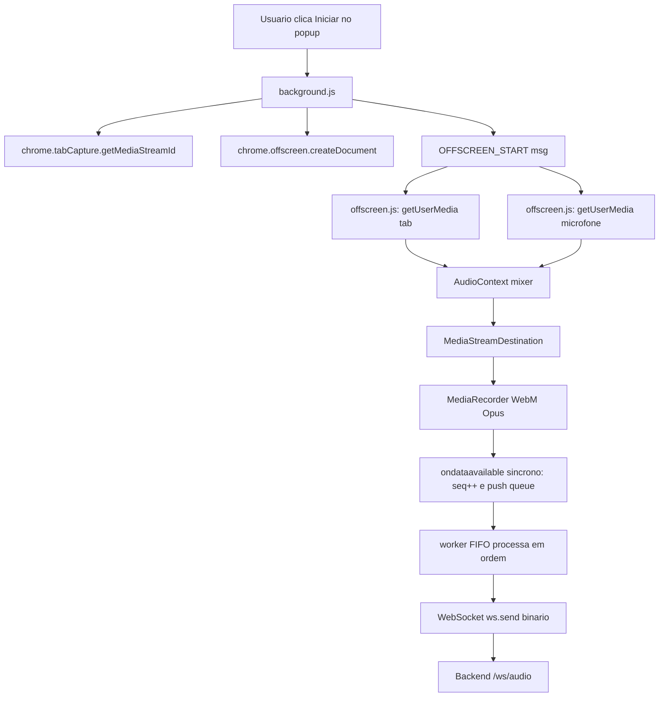
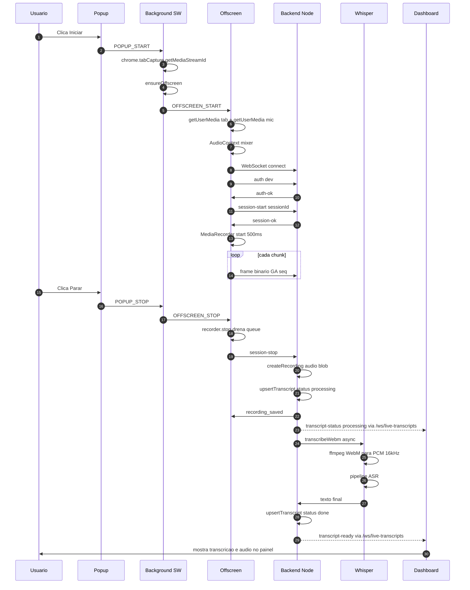

# Arquitetura do Radiante

Monorepo com três componentes que trabalham em conjunto:

```
radiante/
├── src/                  # Frontend React + Vite (painel)
├── valorantapi/          # Backend Node + SQLite + WebSocket
├── extension/            # Extensão Chrome MV3 (Ghost Audio)
└── docs/                 # Esta documentação
```

## Visão geral em alto nível



## Componentes

### 1. Frontend (`src/`)

Painel React 19 + TypeScript + Tailwind v4, buildado com **Vite 8**.

**Páginas principais**:
- `/dashboard` — análise Valorant (Tracker.gg + hardware WMI + coach determinístico)
- `/transcricoes` — listagem e playback das gravações Ghost Audio
- `/reuniao-ao-vivo` — acompanhamento em tempo real das transcrições parciais via WebSocket

**Comunicação com backend**: proxy reverso do Vite dev server (`vite.config.ts`):
- `/api/recordings` → `http://127.0.0.1:3000`
- `/api/transcripts` → `http://127.0.0.1:3000`
- `/ws/audio`, `/ws/live-transcripts` → `ws://127.0.0.1:3000`
- `/api/tracker/*` → Tracker.gg via Ghost-Chrome (bypass Cloudflare)
- `/api/hardware` → plugin Vite local (WMI via PowerShell)
- `/api/ollama` → opcional, Ollama local se presente

### 2. Backend (`valorantapi/`)

Node.js 22 LTS + Express 5 + `better-sqlite3` + `ws` (WebSocketServer).

**Serviços principais**:
- **Valorant**: `/profile`, `/overview`, `/seasons`, `/matches`, `/search` — dados do Tracker.gg via Puppeteer Stealth (`ghostEngine.js`)
- **Ghost Audio**: `/ws/audio` (captura), `/ws/live-transcripts` (broadcast), `/api/recordings`, `/api/transcripts`
- **Auth**: `/auth/register`, `/auth/login` — JWT HS256 + bcrypt 12 rounds

**Transcrição local**: `whisperAdapter.js` usa `@xenova/transformers` + `ffmpeg-static` para rodar Whisper sem API externa.

Banco: **SQLite** em `valorantapi/radiante.db` (WAL mode, foreign keys ativadas).

### 3. Extensão Chrome (`extension/`)

Manifest V3 com:

| Componente | Responsabilidade |
|-----------|-----------------|
| `popup.html/js` | UI, start/stop, level meter, histórico persistido |
| `background.js` | Service worker — orquestra offscreen, storage, logs |
| `offscreen.js` | Captura de áudio, mix tab+mic, WebSocket direto ao backend |
| `content-meet.js` | Injetado no Meet para ler legendas `aria-live` |
| `manifest.json` | Permissions: `tabCapture`, `offscreen`, `storage`, `tabs` |

**Fluxo de áudio dentro da extensão**:



## Decisões arquiteturais importantes

### Por que WebSocket direto no offscreen (e não no background)

Originalmente o `MediaRecorder` estava no offscreen e os chunks binários voavam
via `chrome.runtime.sendMessage` para o background, que reenviava pelo WebSocket.
Essa passagem serializa o `ArrayBuffer` para JSON (um Array gigante de números),
o que é lento e podia **descartar silenciosamente** mensagens sob carga.

Com o WebSocket dentro do próprio offscreen:
- **Zero serialização**: `ws.send(binary)` envia o `ArrayBuffer` nativamente
- **Zero perda de chunks** em payloads de até 100KB
- Handshake (auth + session-start) também fica no offscreen

### Por que mixar microfone + tabCapture

`chrome.tabCapture` só pega o que a aba **toca pelo speaker**. Se o usuário está
sozinho numa reunião e fala, o áudio dele vai pelo microfone do Meet mas **não
volta** para a aba — logo, o tabCapture fica em silêncio.

Solução: captamos microfone com `navigator.mediaDevices.getUserMedia` e mixamos
via `AudioContext` + `MediaStreamAudioDestinationNode`. O `MediaRecorder` grava
do stream mixado, capturando:
- Fala dos outros participantes (via tab)
- Música/vídeo da aba (via tab)
- Fala do próprio usuário (via mic)

### Por que routing do áudio de volta ao speaker

O `tabCapture` intercepta o áudio **antes** do speaker, silenciando a aba no
computador durante a gravação. Para o usuário continuar ouvindo a reunião,
conectamos explicitamente o `tabSource.connect(audioContext.destination)`.
O microfone NÃO é roteado ao speaker (evita loop de eco).

### Por que processamento de transcrição em background

Whisper local pode levar 3-20s para transcrever. Bloquear o `cleanup()` até
ele terminar manteria o WebSocket aberto sem necessidade e atrasaria o feedback
visual para o usuário.

Nova estratégia:
1. Salva recording com `transcript.status = 'processing'` imediatamente
2. Emite `recording_saved` + fecha WebSocket do cliente
3. Roda `onSessionEnd` em background (IIFE async)
4. Quando Whisper termina, faz `upsertTranscript` e broadcast `transcript-ready` em `/ws/live-transcripts`
5. Dashboard escuta esse WS e atualiza automaticamente sem refresh

### Cadeia de fallback da transcrição

Ordem de prioridade em `transcriptionAdapter.onSessionEnd`:

1. **`GHOST_AUDIO_STT_URL`** — endpoint HTTP externo (se configurado)
2. **Whisper local** — `@xenova/transformers` + `ffmpeg-static` (se `WHISPER_ENABLED=true`)
3. **Legendas do Meet** — acumuladas em `ctx.captions` via content script
4. **Placeholder** — mensagem explicativa para o usuário ativar algo acima

## Protocolo binário `/ws/audio`

Frame de 48 bytes de header + payload WebM:

```
[0-1]   magic 0x47 0x41 ("GA")
[2]     versao (0x01)
[3]     tipo (0x01 = audio chunk)
[4-7]   seq uint32 big-endian
[8-43]  sessionId UUID ASCII 36 bytes (padded com espacos)
[44-47] payloadLen uint32 big-endian
[48...] payload (chunk WebM Opus)
```

Implementação: [`valorantapi/src/audioProtocol.js`](../valorantapi/src/audioProtocol.js) e
[`extension/offscreen.js`](../extension/offscreen.js) (`encodeAudioChunk`).

O backend descarta chunks com `seq <= lastSeq`. Por isso a ordem de envio no
cliente deve respeitar exatamente a ordem dos eventos do `MediaRecorder` — daí
a fila FIFO com `seq` atribuído **sincronamente** antes de qualquer `await`.

## Sequência de uma gravação de ponta a ponta



## Portas e endpoints

| Porta | Serviço |
|-------|--------|
| 3000  | Backend Node (HTTP + WebSocket) |
| 5173  | Frontend Vite dev server (com proxy para 3000) |
| 5174  | Frontend Vite fallback (se 5173 ocupada) |
| 11434 | Ollama opcional (se instalado) |
