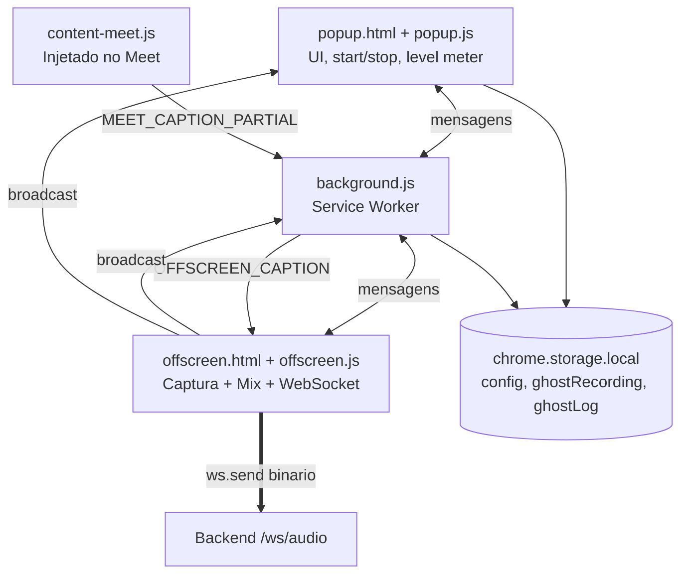
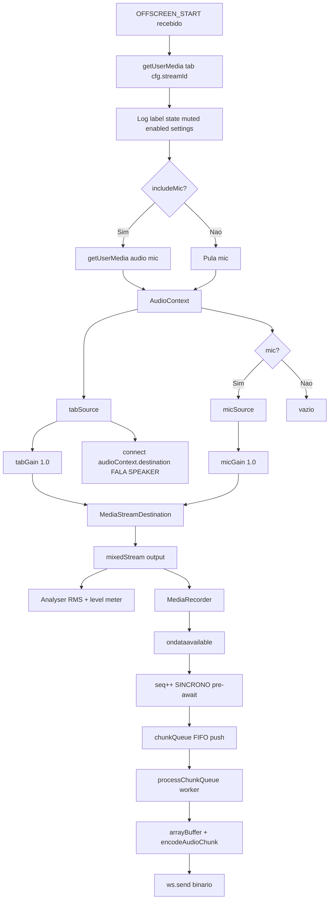
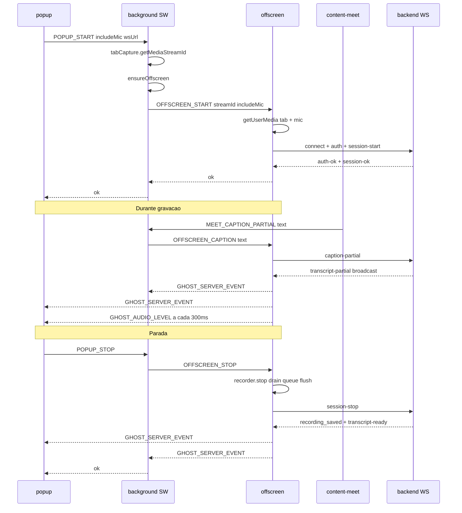

# Extensão Chrome — Radiante Ghost Audio

Manifest V3, pasta [`extension/`](../extension/). Captura áudio do Google Meet
combinando `tabCapture` (aba) + `getUserMedia` (microfone do usuário).

## Componentes



## Permissões (manifest.json)

```json
{
  "permissions": ["offscreen", "tabCapture", "storage", "activeTab", "tabs", "notifications"],
  "host_permissions": [
    "http://127.0.0.1:3000/*",
    "ws://127.0.0.1:3000/*",
    "https://meet.google.com/*"
  ],
  "content_scripts": [{
    "matches": ["https://meet.google.com/*"],
    "js": ["content-meet.js"]
  }]
}
```

### Por que cada permissão

| Permissão | Por quê |
|-----------|---------|
| `tabCapture` | Captura áudio que toca em uma aba |
| `offscreen` | Cria documento offscreen (MediaRecorder + WebSocket ativos com popup fechado) |
| `storage` | Persiste config, estado de gravação, log de eventos |
| `activeTab` | Acessa metadados da aba ativa (título, URL) |
| `tabs` | `chrome.tabs.query({active: true, currentWindow: true})` |
| `notifications` | Não usado no momento (desligado via `NOTIFICATIONS_ENABLED = false`) |
| Host `meet.google.com` | Content script para ler legendas |
| Host `ws://127.0.0.1:3000` | Conectar no backend local |

## `popup.js` — UI

- **Checkbox "Incluir meu microfone"** (default marcado) — se desmarcado, só captura áudio da aba
- **Level meter em tempo real** — barra verde/amarela/vermelha mostrando RMS do áudio mixado
- **Indicador "Silencio detectado Xs"** — alerta se 3+ segundos sem áudio
- **Log persistido** — últimos 30 eventos (gravação iniciada, transcrição pronta, erros) ficam no `chrome.storage.local`
- **Estado restaurado** — ao reabrir o popup, botões refletem se há gravação em andamento

## `background.js` — Service Worker

Orquestrador leve, sem captura direta:

- Recebe `POPUP_START` → faz `tabCapture.getMediaStreamId`, cria offscreen, envia `OFFSCREEN_START`
- Recebe `POPUP_STOP` → envia `OFFSCREEN_STOP`, fecha offscreen
- Recebe `MEET_CAPTION_PARTIAL` do content script → repassa como `OFFSCREEN_CAPTION` ao offscreen
- Escuta `GHOST_SERVER_EVENT` do offscreen → persiste entradas relevantes no `ghostLog`
- Persiste estado em `chrome.storage.local` (`ghostRecording`, `ghostSessionId`)

## `offscreen.js` — Onde a mágica acontece

O coração da captura. Execução em documento offscreen (não é uma aba visível)
para conseguir rodar `MediaRecorder` + `WebSocket` de forma persistente.

### Pipeline



### Regras críticas de ordenação (bugs históricos)

1. **`seq++` é SÍNCRONO** dentro do handler `ondataavailable`, **antes** do `await ev.data.arrayBuffer()`. Caso contrário Promises resolvem em ordem não determinística e chunks chegam com seq trocado.

2. **Worker FIFO** consome `chunkQueue` um de cada vez (`while (chunkQueue.length > 0)`). Chamadas ao `ws.send` respeitam ordem temporal exata do MediaRecorder.

3. **`drainChunkQueue()` no stop** aguarda a fila esvaziar totalmente antes de fechar o WebSocket — último chunk sempre chega.

4. **Sem `recorder.requestData()` antes de `stop()`**. Duplicaria blocos e não é necessário; `stop()` já flush o buffer interno.

### Mix tab + mic via Web Audio

Razão técnica: `tabCapture` pega só o que a aba **toca pelo speaker**. Se você
fala num Meet sozinho, seu microfone vai pelo Meet mas **não volta** pela aba.
Solução: pegar o mic separadamente via `getUserMedia` e mixar.

O `MediaStreamAudioDestinationNode` cria um stream "virtual" que recebe a soma
dos dois GainNodes; o `MediaRecorder` grava dele.

### Routing de volta ao speaker

`tabSource.connect(audioContext.destination)` garante que o áudio da aba
continue tocando no sistema durante a gravação. O microfone **NÃO** é roteado
ao speaker (evita loop de eco).

### Level meter

`AnalyserNode` com `fftSize=512` + `getByteTimeDomainData`. RMS calculado a
cada 300ms e broadcast como `GHOST_AUDIO_LEVEL` para o popup. Se RMS < 0.01
por 3000ms, o popup mostra aviso "Silencio detectado".

## `content-meet.js`

Rodando em `https://meet.google.com/*`. Lê elementos `[aria-live]` via
`MutationObserver` + `setInterval(1s)`, deduplica e envia via
`chrome.runtime.sendMessage` para o background.

Proteções:
- **Dedupe** via Set (últimas 300 legendas lembradas)
- **Auto-desativação** se detectar `Extension context invalidated` ou
  `receiving end does not exist` (extensão foi recarregada enquanto Meet
  estava aberto)
- **Cleanup no `pagehide`** e `beforeunload`

## Fluxos de mensagens entre componentes



## Debug rápido

- **DevTools do popup**: clique com botão direito no popup → "Inspecionar"
- **DevTools do service worker**: `chrome://extensions` → clique no link "service worker" na extensão
- **DevTools do offscreen**: `chrome://extensions` → "Inspecionar visualizações: offscreen.html"
- **Storage**: inspecione `chrome.storage.local` na aba "Application" das DevTools do popup
