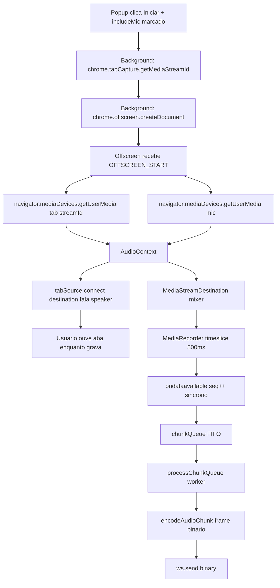
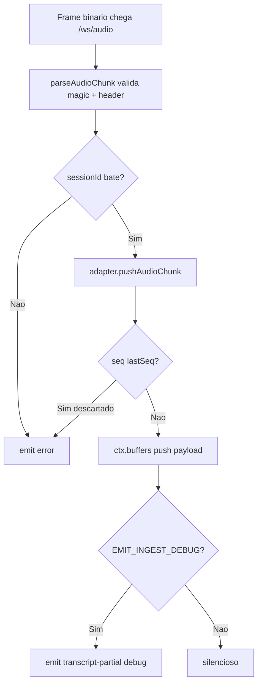
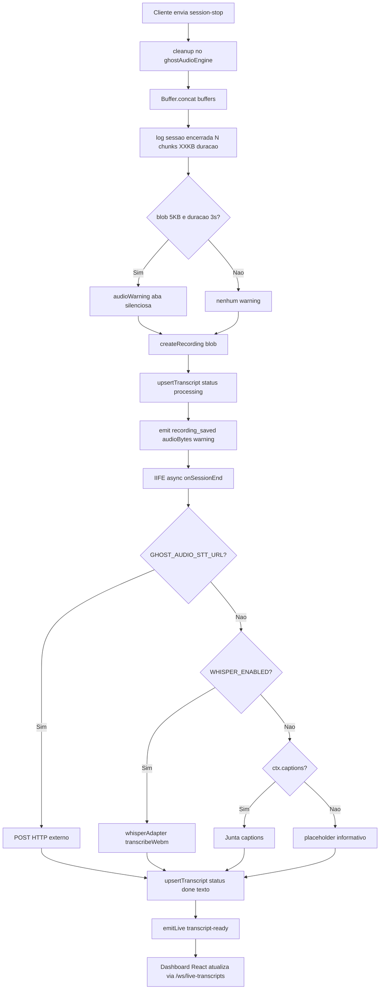

# Ghost Audio — Motor de Captura e Transcrição

Sistema end-to-end que captura áudio de reuniões no Google Meet, transmite em
tempo real para o backend Node, salva em SQLite e transcreve automaticamente
usando Whisper local em português.

## Stack mesclada

| Camada | Tecnologia | Por que foi escolhida |
|--------|-----------|----------------------|
| Captura na aba | `chrome.tabCapture` (Chrome extension API) | Único caminho oficial em MV3 para pegar áudio que toca em uma aba |
| Captura do microfone | `navigator.mediaDevices.getUserMedia` | Complementa o tabCapture quando o usuário está sozinho na reunião |
| Mixagem | Web Audio API (`AudioContext`, `GainNode`, `MediaStreamAudioDestinationNode`) | Soma os dois streams num único stream para o MediaRecorder, sem perder qualidade |
| Codec de gravação | `MediaRecorder` com `audio/webm;codecs=opus` | Opus = melhor compressão para voz, nativamente suportado pelo Chrome |
| Offscreen document | `chrome.offscreen` | Permite MediaRecorder ativo mesmo com popup fechado (service worker sozinho não pode) |
| Transporte | WebSocket binário (`ws://...:3000/ws/audio`) | Stream bidirecional, zero serialização JSON |
| Protocolo de frame | Custom binário 48B header + payload | Permite sessionId + seq + validação magic em cada chunk |
| Backend WS | `ws@8.x` (biblioteca Node) + `noServer: true` + upgrade manual | Evita Express responder ao handshake (causa "Invalid frame header") |
| Persistência | `better-sqlite3` com WAL mode | Leitura concorrente rápida, sem servidor externo, um único arquivo `radiante.db` |
| Decode servidor | `ffmpeg-static` (binário empacotado) | Converte WebM Opus para PCM 16kHz mono que o Whisper espera |
| Transcrição | `@xenova/transformers` rodando Whisper ONNX | 100% local, sem API paga, modelos de 75MB a 1.5GB |
| Modelo default | `Xenova/whisper-small` (português) | Melhor custo-benefício: ~250MB, precisão boa, roda em CPU |

## Fluxo detalhado

### 1. Captura na extensão



### 2. Ingestão no backend



### 3. Encerramento e persistência



## Variáveis de ambiente

Arquivo [`valorantapi/.env`](../valorantapi/.env):

| Variável | Descrição | Default |
|----------|-----------|--------|
| `PORT` | Porta HTTP/WS do backend | `3000` |
| `JWT_SECRET` | Obrigatório para `/auth`; opcional para WS (com `dev:true`) | — |
| `GHOST_AUDIO_MAX_SESSIONS` | Máx. de sessões de áudio simultâneas | `4` |
| `GHOST_AUDIO_MAX_WS` | Máx. de conexões WebSocket | `8` |
| `GHOST_AUDIO_STT_URL` | Endpoint HTTP externo para STT (opcional) | — |
| `GHOST_AUDIO_EMIT_INGEST_DEBUG` | Emite parciais de debug `[ghost-audio] ingestão: N chunks...` | `false` |
| `WHISPER_ENABLED` | Ativa transcrição Whisper local | `false` |
| `WHISPER_MODEL` | Modelo HuggingFace | `Xenova/whisper-small` |
| `WHISPER_LANG` | Idioma (nome em inglês) | `portuguese` |
| `WHISPER_TASK` | `transcribe` ou `translate` | `transcribe` |

## Protocolo WebSocket

### Fase AUTH (obrigatória)

Cliente → Servidor (JSON texto):
```json
{ "type": "auth", "dev": true }
```

Ou com JWT:
```json
{ "type": "auth", "token": "eyJhbGciOiJIUzI1NiIs..." }
```

Servidor → Cliente:
```json
{ "type": "auth-ok", "dev": true, "userId": null }
```

### Fase SESSION-START (obrigatória)

Cliente:
```json
{
  "type": "session-start",
  "sessionId": "uuid-v4",
  "consentVersion": 1,
  "sourceType": "meet",
  "tabUrl": "https://meet.google.com/xxx-yyyy-zzz",
  "hostname": "meet.google.com",
  "tabTitle": "Meet: xxx-yyyy-zzz",
  "mimeType": "audio/webm;codecs=opus"
}
```

Servidor:
```json
{ "type": "session-ok", "sessionId": "uuid-v4" }
```

### Fase STREAMING (frames binários)

Cliente envia frames WebSocket **binários** com o formato documentado em
[`audioProtocol.js`](../valorantapi/src/audioProtocol.js).

Servidor pode emitir ao vivo:
```json
{ "type": "transcript-partial", "sessionId": "...", "text": "...", "source": "meet-captions" }
```

Durante esta fase, o cliente pode também enviar JSON de legendas:
```json
{ "type": "caption-partial", "text": "fala extraída do Meet via aria-live" }
```

### Fase SESSION-STOP

Cliente:
```json
{ "type": "session-stop", "durationMs": 19332 }
```

Servidor emite em sequência:
```json
{ "type": "recording_saved", "recordingId": "uuid", "audioBytes": 310478, "warning": null }
{ "type": "transcript-status", "status": "processing", "recordingId": "uuid" }
{ "type": "session-stopped" }
```

E em background (depois do Whisper processar):
```json
{ "type": "transcript-ready", "recordingId": "uuid", "status": "done", "text": "..." }
```

## Esquema SQLite

```sql
CREATE TABLE recordings (
  id            TEXT PRIMARY KEY,
  session_id    TEXT NOT NULL UNIQUE,
  user_id       TEXT,
  source_type   TEXT NOT NULL DEFAULT 'tab',
  source_app    TEXT NOT NULL DEFAULT 'other',
  source_url    TEXT,
  source_host   TEXT,
  tab_title     TEXT,
  mime_type     TEXT NOT NULL,
  duration_ms   INTEGER,
  audio_blob    BLOB NOT NULL,
  created_at    INTEGER NOT NULL DEFAULT (unixepoch())
);

CREATE TABLE transcripts (
  id              TEXT PRIMARY KEY,
  recording_id    TEXT NOT NULL UNIQUE,
  text            TEXT NOT NULL,
  status          TEXT NOT NULL DEFAULT 'done',
  created_at      INTEGER NOT NULL DEFAULT (unixepoch()),
  updated_at      INTEGER NOT NULL DEFAULT (unixepoch()),
  FOREIGN KEY (recording_id) REFERENCES recordings(id) ON DELETE CASCADE
);
```

**Exclusão em cascata bidirecional**:
- `DELETE /api/recordings/:id` → remove recording + transcript vinculado
- `DELETE /api/transcripts/:id` → também remove o recording associado

## Métricas observadas em produção local

Whisper-small, Node 22, Windows 11, CPU desktop:

| Áudio | Tamanho | Duração | Decode ffmpeg | Whisper infer | Total |
|-------|---------|---------|---------------|---------------|-------|
| Reunião curta (6s, tons) | 55KB | 6s | 0.1s | 1.7s | 2.6s |
| Frase TTS (8s) | 87KB | 8s | 0.0s | 2.5-2.7s | ~3s |
| Reunião ~20s | 303KB | 19.3s | 0.1s | 3.5s | 3.6s |
| Reunião ~9s densa | 140KB | 8.9s | 0.0s | 20s | 20s |

Infer fica na faixa de **~5x real-time** para reuniões com pouco silêncio.

secret: atsitua res ed soicifelam e soicifeneb sodiuges said siod rimrod uov euq ohca latnem aton : levazilitu ogla uoriv etnemlanif acebac ahnim an avatse euq aiedi a e 64:5 oas
